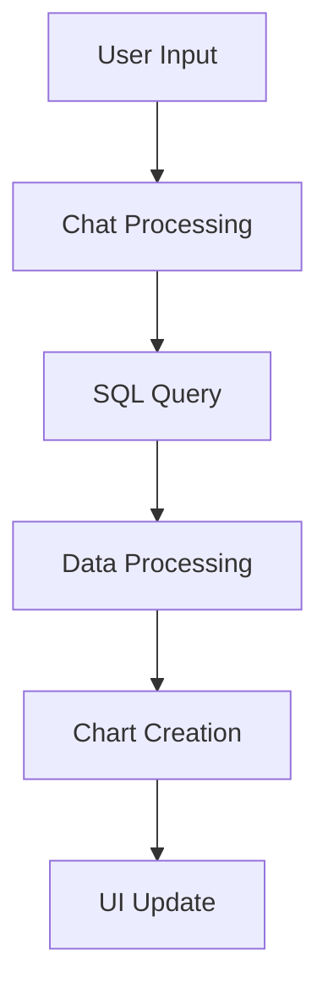

# Line Chart Creation Flow Documentation

This document details the process of creating a line chart in QDash, from user input to final visualization.

## Flow Overview



## Detailed Process Flow

### 1. User Input to AI Processing
- User submits a request for a line chart
- Request is processed by `chatController.js`
- AI model analyzes the request and determines:
  - Need for data query
  - Chart type (line)
  - Required parameters

### 2. SQL Query Execution
- AI generates appropriate SQL query
- Query is executed via `executeDuckDbQuery`
- Results are stored in window object:
  ```javascript
  window.x = queryResult.map(row => Object.values(row)[0]);
  window.y = queryResult.map(row => Object.values(row)[1]);
  ```

### 3. Chart Creation Tool Call
The AI makes a tool call with the following structure:
```javascript
{
    type: "function",
    function: {
        name: "createChart",
        parameters: {
            x: [...], // Array of x values
            y: [...], // Array of y values
            chartType: "line",
            title: "Daily Orders",
            xAxisTitle: "Day of the Week",
            yAxisTitle: "Order Count"
        }
    }
}
```

### 4. Tool Execution Process
1. **Tool Call Handling** (`toolExecutor.js`):
   ```javascript
   console.log("🛠️ Tool Call: createChart");
   console.log("Arguments:", {
       x: Array(7),
       y: Array(7),
       chartType: 'line',
       title: 'Daily Orders',
       xAxisTitle: 'Day of the Week'
   });
   ```

2. **Chart Creation** (`createChart.js`):
   ```javascript
   createChart(id, x, y, chartType, title, xAxisTitle, yAxisTitle) {
       // Create trace for the line chart
       var trace = { 
           x: x,
           y: y,
           type: 'line'
       };

       // Configure layout
       var layout = {
           title: title,
           xaxis: {
               title: {
                   text: xAxisTitle
               }
           },
           yaxis: {
               title: {
                   text: yAxisTitle
               }
           },
           autosize: true
       };

       // Render using Plotly
       Plotly.newPlot(id, [trace], layout, {responsive: true});
   }
   ```

### 5. Example Data Flow
From the console logs, we can see a real example:
```javascript
x: [0, 1, 2, 3, 4, 5, 6]  // Days of the week
y: [600905, 587478, 467260, 436972, 426339, 453368, 448761]  // Order counts
```

### 6. Configuration Details

#### Tool Configuration (`toolsConfig.js`)
```javascript
{
    type: "function",
    function: {
        name: "createChart",
        parameters: {
            x: { type: "array" },
            y: { type: "array" },
            chartType: { 
                type: "string",
                enum: ["line", "bar", "scatter", "pie"]
            },
            title: { type: "string" },
            xAxisTitle: { type: "string" },
            yAxisTitle: { type: "string" }
        },
        required: ["x", "y", "chartType", "title"]
    }
}
```

## Error Handling

1. **Data Validation**
   - Checks for valid x and y arrays
   - Validates chart type
   - Ensures required parameters are present

2. **Rendering Errors**
   - Plotly error handling
   - DOM element existence checks
   - Data type compatibility checks

## Best Practices

1. **Data Preparation**
   - Ensure data arrays are of equal length
   - Convert data types appropriately
   - Handle null/undefined values

2. **Chart Configuration**
   - Use meaningful axis titles
   - Set appropriate chart dimensions
   - Enable responsiveness

3. **Performance**
   - Optimize data processing
   - Use efficient DOM operations
   - Enable chart responsiveness

## Example Usage

To create a line chart showing daily orders:

1. User Input:
   ```
   "Show me a line chart of daily orders"
   ```

2. System Process:
   - Executes SQL query for daily orders
   - Processes data into x and y arrays
   - Creates chart with appropriate labels
   - Renders in UI with Plotly

3. Result:
   - Interactive line chart
   - X-axis: Days of the week
   - Y-axis: Order counts
   - Responsive layout
   - Hover interactions

## Debugging Tips

1. Check console logs for:
   - Tool call parameters
   - Data array contents
   - Axis title configurations
   - Chart creation status

2. Common Issues:
   - Missing axis titles
   - Data type mismatches
   - Array length mismatches
   - DOM element availability
